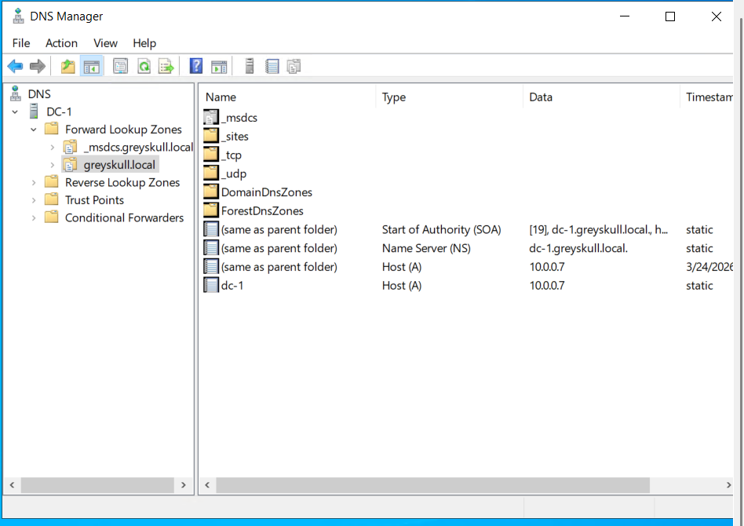
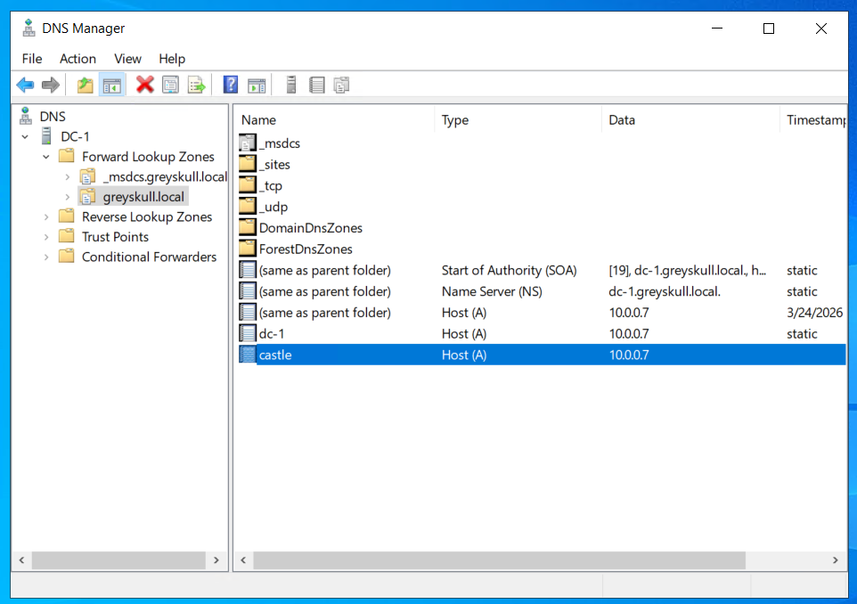
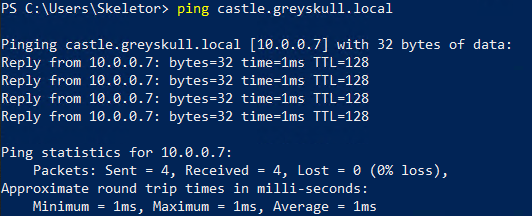
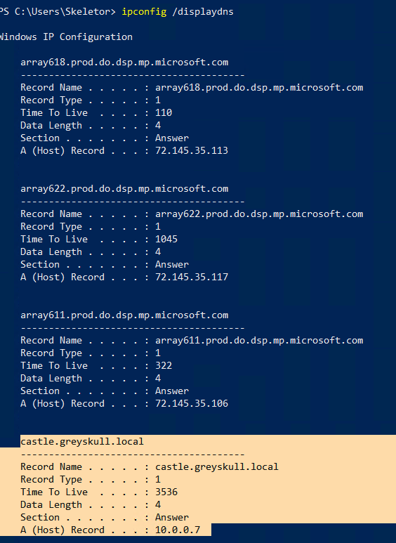
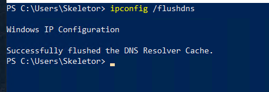
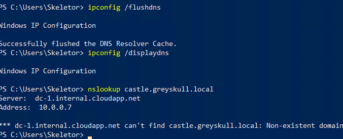
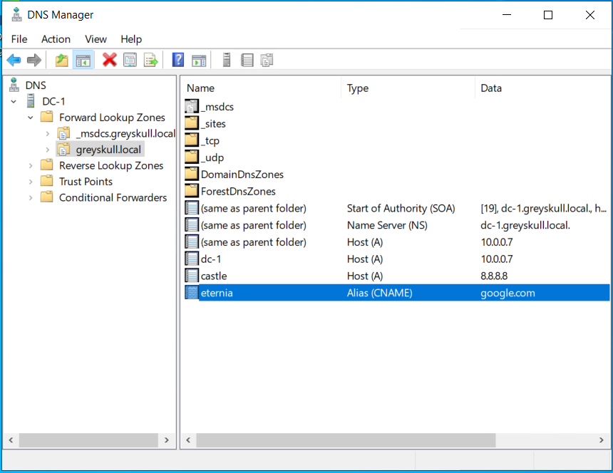
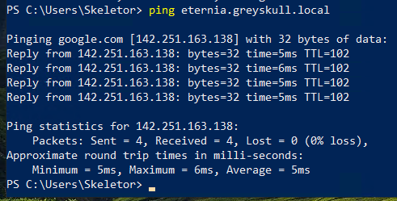
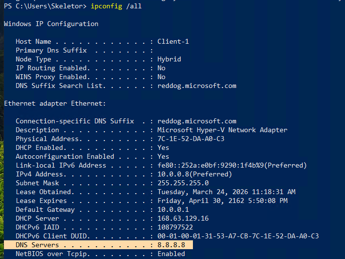
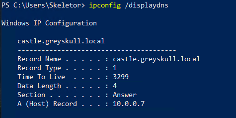

# DNS Configuration & Name Resolution Analysis in a Windows Server Environment

---

##  🔹Project Summary
#### This project demonstrates hands on configuration and analysis of Domain Name System (DNS) services within a Windows Server environment. 
#### Key tasks included creating and managing DNS records, analyzing name resolution behavior between client and server systems, and understanding how local DNS servers interact with external DNS infrastructure. 
- ### Technology and Tools:
  - Windows Server 2022 DNS Server
  - Windows 10 Client
  - Microsoft Azure (Virtual Machine Hosting)
  - DNS manager
  - PowerShell (nslookup, ipconfig) 
  - Active Directory integrated DNS
#### This project reflects real world networking responisibilities related to name resolution, service accessibility, and basic network troubleshooting.
---

## 🔹Objectives
- Configure and manage DNS records (A Records, CNAME Records)
- Analyze client side DNS behavior
- Observe DNS functionality and propagation effects
- Understand how local DNS servers resolve external domain queries
- Strengthen foundational networking and troubleshooting skills
---

## 🔹Environment Setup
- DNS Server: Windows Server 2022 (dc-1)
- Client Machine: Windows 10
- Domain: isabelsdomain.com
- DNS Type: Active Directory Integrated DNS
  #### Tools Used within environment:
  - PowerShell:
  - ping
  - nslookup
  - ipconfig
  - ipconfig /displaydns
  - ipconfig /flushdns
- DNS Manager
#### This environment simulates an internal network where the domain controller also functions as the DNS server.
---

## 🔹Inspecting Existing DNS Records
#### Accessed DNS Manager on the domain controller (DC-1) and reviewed A-Records within the forward lookup zone.
  - Verified hostname to IP mappings for domain resources
  - Observed how internal systems are registered in the DNS

---

## 🔹Creating and Testing A-Records
#### Created a custom A-Record and mapped it to a specific IP address
### On the client machine:
  - Used nslookup to confirm name resolution
  - Used ping to verify connectivity
### Result: Successfully validated that the DNS server resolved the new hostname to the correct IP address.

---
## 🔹Deleting Records and Analyzing DNS Cache
#### Deleted the A-Record from the DNS Server
### On the client machine:
  - The hostname still resolved due to the cached DNS entries
  - Ran ipconfig /displaydns to confirm cached record
  - Cleared cache using ipconfig /flushdns
  - Re-tested resolution using nslookup
### Result: After clearing the cache, the hostname no longer resolved, demonstrating the impact of DNS caching.

---
## 🔹Creating and Testing CNAME Records 
#### Configured a CNAME record to map an alias to an existing hostname
  - Queried the alias using nslookup
  - Verified that it resolved to the correct target
#### Result: Confirmed proper alias functionality and understanding the indirect name resolution.
## Testing External DNS Resolution
#### Performed DNS queries for external domains (i.e., google.com)
  - Observed that the local DNS server resolved the external names
  - Understood that this occurs through root hints and external DNS servers
#### Result: Demonstrated how internal DNS servers interact with global DNS infrastructure.

 

---
## 🔹Troubleshooting Scenario
### Issue
#### The client machine was unable to resolve the internal hostname castle.greyskull.local.
 - ### Symptoms
   - nslookup returned a “Non existent domain” error
   - DNS server was shown as 8.8.8.8 instead of the domain controller
 - ### Diagnosis
   - Ran ipconfig /all to verify network configuration
   - Identified that the client machine was using an external DNS server (8.8.8.8)
   - Confirmed that the incorrect DNS server was preventing resolution of internal domain records
 - ### Resolution
    - Updated the client machine’s DNS settings to point to the domain controller (10.0.0.7)
    - Cleared the DNS cache using ipconfig /flushdns
## Outcome 
#### Re-ran nslookup and confirmed successful resolution and The hostname correctly resolved to the internal IP address.

---
## 🔹Key Takeaways
- DNS translates human readable domain names into IP addresses required for network communication
- A Records and CNAME Records serve different roles in name resolution and rescource mapping
- DNS caching improves performance but can temporarily mask changes
- Local DNS servers rely on root hints and external servers for internet resolution
- Understanding DNS behavior is critical for diagnosing connectivity and access issues

---

